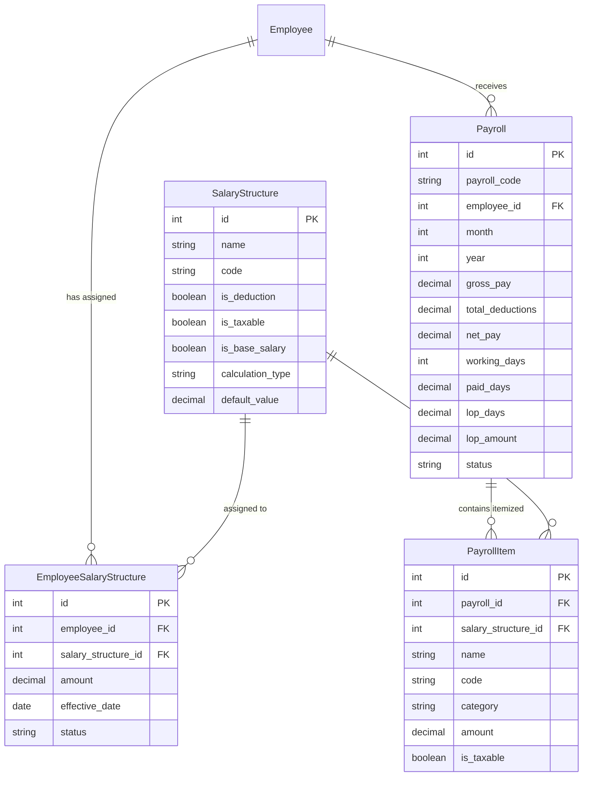

# Multi-Salary Structure & End-to-End Payroll Flow

We have implemented a dynamic multi-salary structure mapping architecture and an end-to-end payroll generation pipeline across the backend (`mkx-hrms-be`), web frontend (`mkx-hrms-fe`), and mobile app (`mkx_hrms_mobile`).

---

## 1. Architecture Overview

---

## 2. Key Changes Made

### A. Database Layer (`mkx-hrms-be/prisma/schema.prisma`)
- **Decoupled static keys**: Removed static `base_salary` on Employee in favor of dynamic assignments.
- **Enriched `SalaryStructure`**: Added `is_deduction`, `is_taxable`, `is_base_salary`, `calculation_type` ("Fixed" | "Percentage"), and `default_value`.
- **Created `EmployeeSalaryStructure`**: Dedicated junction table mapping an employee to multiple salary structures with custom individual amount overrides.
- **Created `PayrollItem` & enriched `Payroll`**: Itemized breakdown table recording every earning, deduction, and Loss of Pay (LOP) adjustment with cycle month and year.

### B. Backend Services & Controllers (`mkx-hrms-be`)
- **[employees.controller.ts](file:///c:/Users/lenovo/Desktop/MKXDev/mkx-hrms/mkx-hrms-be/src/v1/controllers/employees.controller.ts)**:
  - Added `getEmployeeSalaryStructures` (`GET /v1/employees/:id/salary-structures`).
  - Added `assignEmployeeSalaryStructures` (`POST /v1/employees/:id/salary-structures`).
  - Updated `getEmployees` to include assigned structures.
  - Updated `createEmployee` and `updateEmployee` to persist assigned components atomically.
- **[payroll.controller.ts](file:///c:/Users/lenovo/Desktop/MKXDev/mkx-hrms/mkx-hrms-be/src/v1/controllers/payroll.controller.ts)**:
  - Added `generatePayroll` (`POST /v1/payroll/generate`): Computes working days in month, unpaid leaves (LOP days), pro-rated daily wage loss, gross pay, total deductions, and net pay. Supports `preview: true` for dry-run calculations and `preview: false` for database generation.
  - Added `processBatchPayroll` (`POST /v1/payroll/process-batch`): Batch status transition (`Processed` / `Paid`).
  - Updated `getPayroll`, `getMyPayroll`, and `exportPayroll` with itemized line items.

### C. Web Frontend (`mkx-hrms-fe`)
- **[ManageEmployee Drawer](file:///c:/Users/lenovo/Desktop/MKXDev/mkx-hrms/mkx-hrms-fe/src/pages/Employees/ManageEmployee/index.tsx)**:
  - Added interactive "Compensation & Multiple Salary Structures" builder.
  - Allows selecting and assigning multiple components (basic salary, allowances, deductions) with individual amount inputs.
  - Displays real-time calculations for Gross Pay, Total Deductions, and Net Monthly Pay.
- **[RunPayrollDialog](file:///c:/Users/lenovo/Desktop/MKXDev/mkx-hrms/mkx-hrms-fe/src/pages/Payroll/RunPayrollDialog.tsx)**:
  - Interactive modal with Month, Year, and Department selection.
  - Real-time "Calculate Preview" showing summary KPIs and individual employee breakdown with paid days, LOP days, and assigned component pills.
  - One-click batch confirmation.
- **[Payroll Page](file:///c:/Users/lenovo/Desktop/MKXDev/mkx-hrms/mkx-hrms-fe/src/pages/Payroll/index.tsx)**:
  - Connected "Run Payroll" button to `RunPayrollDialog`.
  - Added "Approve Batch" button for pending cycles.
  - Updated columns to show Gross Pay and Deductions.
  - Upgraded payslip modal to render itemized earnings vs deductions breakdown.
- **[SalaryStructureMasterTab](file:///c:/Users/lenovo/Desktop/MKXDev/mkx-hrms/mkx-hrms-fe/src/pages/Masters/components/SalaryStructureMasterTab.tsx) & [ManageSalaryStructureDrawer](file:///c:/Users/lenovo/Desktop/MKXDev/mkx-hrms/mkx-hrms-fe/src/pages/Masters/drawers/ManageSalaryStructureDrawer.tsx)**:
  - Configured dynamic components with Type (Earning vs Deduction), Base Salary flag, Taxable flag, and calculation types.

### D. Mobile App (`mkx_hrms_mobile`)
- **[payslip_model.dart](file:///c:/Users/lenovo/Desktop/MKXDev/mkx-hrms/mkx_hrms_mobile/lib/features/payroll/models/payslip_model.dart)**:
  - Added `PayslipItem` model parsing itemized components.
  - Added `grossPay`, `totalDeductions`, `workingDays`, `paidDays`, `lopDays`, `lopAmount`.
- **[payslip_detail_modal.dart](file:///c:/Users/lenovo/Desktop/MKXDev/mkx-hrms/mkx_hrms_mobile/lib/features/payroll/widgets/payslip_detail_modal.dart)**:
  - Rendered Attendance breakdown (Working vs Paid vs LOP Days).
  - Rendered separate itemized sections for Earnings & Allowances and Deductions & Statutory Taxes.
